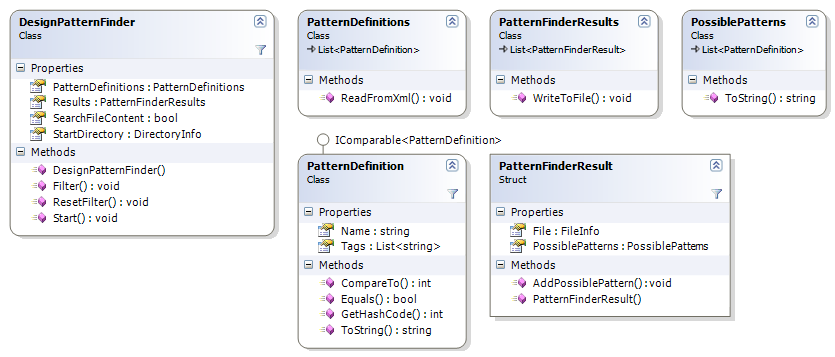
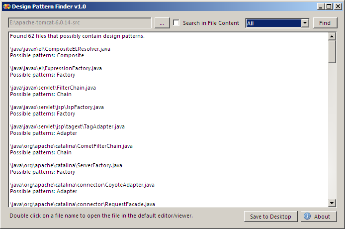

**Project Description**
This Windows application can search a source code directory for possible Gang of Four design patterns.
Works with .cs, .vb, .java and .php file extensions.

Other features:
- Save results to .txt file;
- Configure design pattern definitions through xml file;
- Filter results by pattern;
- Open source code file from the application;
- Option to search in source code file content.

Todo:
- Specify pattern definition with tags to make search result more accurate and possibly weighted.
  For example: "This file possible contains the Decorator pattern, accuracy 78%."

**Class Diagram**

**Screenshot**

**Download**

[release:8848](release_8848)